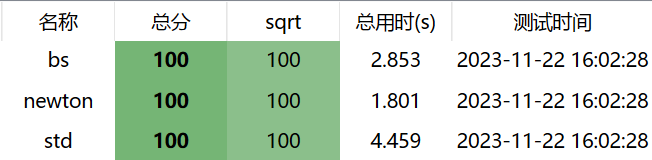
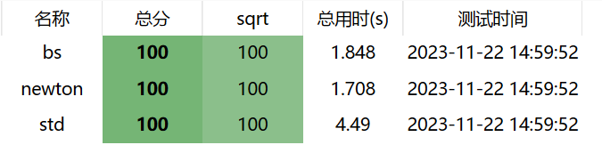

# 求平方根实验报告

## 题目要求

1. 编程实现 $sqrt(x)$ 函数。以 $sqrt(2)$ 为例，可将其转换为 $f(x)=x^2-2$ 的根，也就是 $f(x)$ 与 $x$ 轴的交点。
2. 讨论快速平方根计算算法。

## 实现思路

### 方法一（二分法）

利用 $f(x) = x ^ 2$ 在 $[0,+ \infty)$ 的单调性，使用二分法找根

### 方法二（牛顿迭代法）

利用牛顿迭代法找方程 $x ^ 2 - A = 0$ 的解。

## 结果

两种方法的效果都很好，都比系统提供的，但牛顿迭代法效率更高，开启 O2 优化后，两者差距缩小。


不开启 O2 优化运行 $20$ 组数据。每组数据 $10^5$ 个整数求平方根。


开启 O2 优化

## 总结与反思

牛顿法求平方根效率更高。

但是这个算法也并非不能优化。在计算机图形领域中，平方根倒数是一种常用函数，这一函数经过多年优化，有快速求近似解的代码，我们将这一代码得到的近似解作为初始值带入牛顿迭代法，可以获得更优的解法。最终代码如下：

```cpp
double mysqrt(double num){
	long i;
	float x2, y;
	const float threehalfs = 1.5F;
	x2 = num * 0.5F;
	y = num;
	i = *(long*)&y;
	i = 0x5f3759df - (i >> 1);
	y = *(float *)&i;
	y = y * (threehalfs - (x2 * y * y));
	double ans = 1.0 / y;
    double last = -1;
    while(fabs(ans - last) > ACC){
        last = ans;
        ans = ans - (ans * ans - num) / (2 * ans);
    }
    return ans;
}
```

优化后，我们的代码在开启 O2 优化的情况下，甚至可以跑到 $1.5s$ 左右！


可见，代码的优化永无止境。